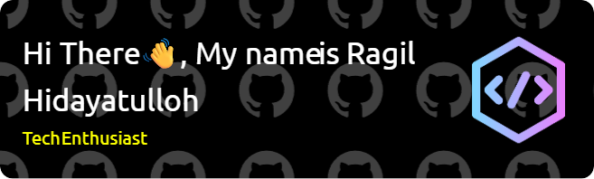

<h1 align="center"> Welcome To My Github Profile  <h1>

## ✨About Me:
🏫 I'm currently an Information Systems undergrad at UPN "Veteran" East Java. 
🧠 I'm currently exploring React and the Android ecosystem. 
💻 I'm a keen enthusiast, always exploring new tech in the programming world. 

## 🌐My Social Media:

    
    
    
    

